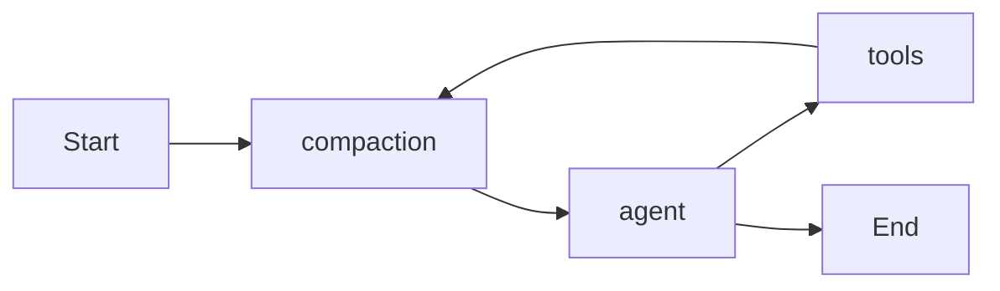
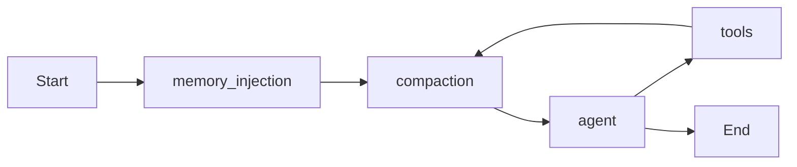

# Memoria A Largo Plazo

## Alcance

Implementar dos caminos separados:

- Extracción asíncrona post-sesión: `memory_flush.ts` lee el historial persistido en `agent_messages`, extrae recuerdos conservadores y los guarda en Supabase.
- Recuperación síncrona pre-turno: `memory_injection_node.ts` busca recuerdos relevantes para el input actual y enriquece `systemPrompt` antes de `compaction`.

El grafo actual en [`packages/agent/src/graph.ts`](packages/agent/src/graph.ts) pasará de:



a:



## Cambios De Base De Datos

Crear una migración nueva en [`packages/db/supabase/migrations`](packages/db/supabase/migrations) que:

- Habilite `vector` con `create extension if not exists vector`.
- Cree `public.memories` con `id`, `user_id`, `type`, `content`, `embedding vector(1536)`, `retrieval_count default 0`, `created_at`, `last_retrieved_at`.
- Agregue constraints para `type in ('episodic', 'semantic', 'procedural')` y FK a `profiles(id)`.
- Active RLS con política de usuario dueño, aunque el agente use service role.
- Agregue índice vectorial con `vector_cosine_ops` y un RPC `match_memories(query_embedding vector(1536), match_user_id uuid, match_count int)` para ordenar por cosine similarity desde Supabase.

También extender [`packages/types/src/index.ts`](packages/types/src/index.ts) con `MemoryType` y `Memory` y agregar queries en [`packages/db/src/queries/memories.ts`](packages/db/src/queries/memories.ts): insertar recuerdos, buscar por RPC e incrementar `retrieval_count`/`last_retrieved_at`.

## Extracción Post-Sesión

Crear [`packages/agent/src/memory_flush.ts`](packages/agent/src/memory_flush.ts) con una función exportada tipo `flushSessionMemories({ db, userId, sessionId })` que:

- Cargue el historial completo de `agent_messages` para esa sesión, en orden cronológico.
- Ignore sesiones vacías o con muy poco contenido útil.
- Llame a Haiku por OpenRouter con un prompt conservador que solo devuelva JSON `{ type, content }[]` y permita `[]`.
- Valide la respuesta con `zod`, descartando tipos inválidos, contenido vacío y recuerdos demasiado triviales.
- Genere embeddings `openai/text-embedding-3-small` para cada recuerdo vía OpenRouter.
- Inserte los recuerdos en `memories`.

Conectar ese flush fuera del loop del agente en estos puntos:

- Cierre explícito: agregar endpoint de sesión para marcar `agent_sessions.status = 'closed'` y ejecutar flush antes o durante el cierre.
- Cambio de sesión web: cambiar [`apps/web/src/app/chat/chat-interface.tsx`](apps/web/src/app/chat/chat-interface.tsx) para llamar a un endpoint de switch/flush antes de `setActiveSessionId`.
- Cambio de sesión Telegram: ejecutar flush en `/switch` dentro de [`apps/web/src/app/api/telegram/webhook/route.ts`](apps/web/src/app/api/telegram/webhook/route.ts) antes de actualizar `updated_at` de la sesión destino.
- Limpieza web y Telegram: ejecutar flush antes de borrar `agent_messages`, `tool_calls` o checkpoints en las rutas existentes de `/clear`.

## Recuperación E Inyección

Crear [`packages/agent/src/nodes/memory_injection_node.ts`](packages/agent/src/nodes/memory_injection_node.ts) como nodo puro de recuperación:

- Leer `userInput` y `userId` desde `GraphState`.
- Generar embedding del input actual con `openai/text-embedding-3-small`.
- Consultar `match_memories` con `match_count` configurable, por defecto 8.
- Incrementar `retrieval_count` y `last_retrieved_at` solo para IDs recuperados.
- Si no hay recuerdos, retornar `{}`.
- Si hay recuerdos, retornar `{ systemPrompt: enrichedPrompt }` con un bloque delimitado:

```text
[MEMORIA DEL USUARIO]
- (semantic) ...
- (procedural) ...
- (episodic) ...
[/MEMORIA DEL USUARIO]
```

Extender [`packages/agent/src/state.ts`](packages/agent/src/state.ts) con `userInput` para que el nodo pueda usar el mensaje actual sin inspeccionar `messages`. En [`packages/agent/src/graph.ts`](packages/agent/src/graph.ts), agregar el nodo antes de `compaction` y pasar `userInput: message` en el `app.invoke` inicial. En resumes de HITL no se ejecutará retrieval nuevo, porque no hay `message` nuevo.

## Verificación

- Ejecutar type-check de `@agents/db` y `@agents/agent`.
- Probar manualmente que un turno nuevo llama `memory_injection` antes de `compaction` y no duplica mensajes.
- Probar que `/clear`, switch web, `/switch` Telegram y cierre explícito ejecutan flush antes de perder historial.
- Validar en Supabase que `embedding` sea de dimensión 1536, `retrieval_count` suba al recuperar y que `match_memories` limite a 5-8 recuerdos.